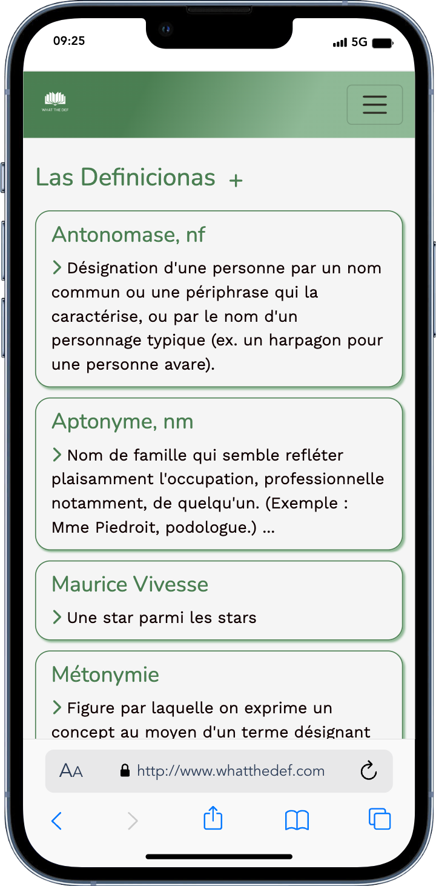
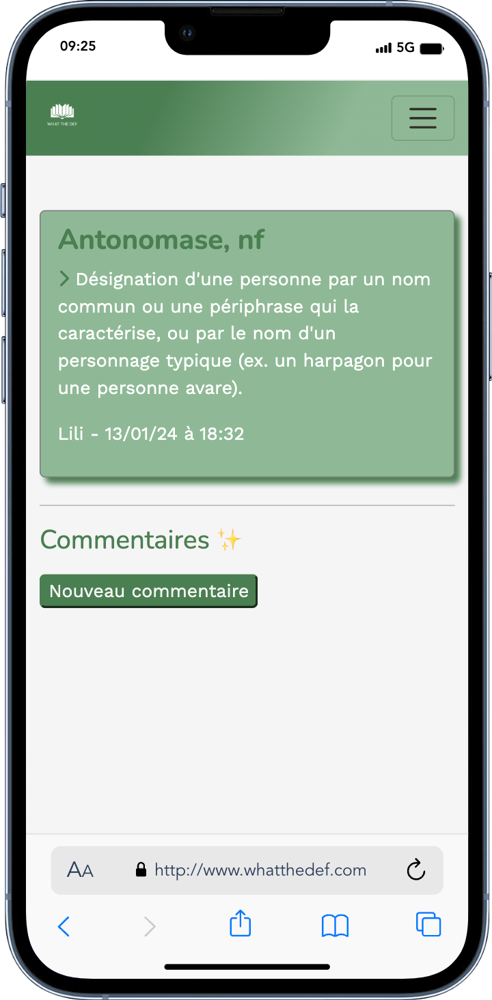
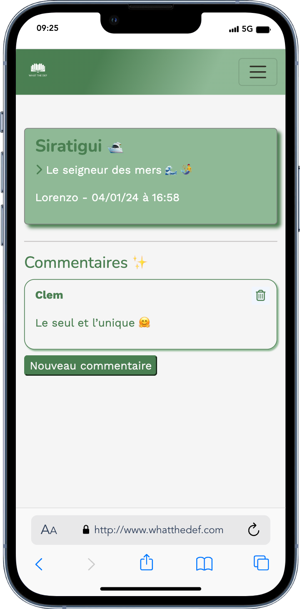
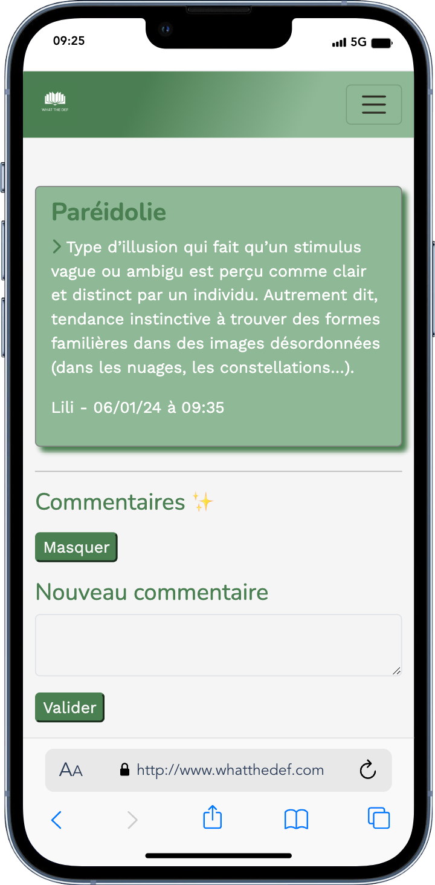

<h1>WHAT THE DEF</h1>

WHAT THE DEF is a Family Glossary. Its aim is to exchange definitions discovered through readings or talks in between members of a family.

Inspired by a mom that tends to forget things, writes it down in notebooks and then forgets it again.

<ul>
  
Features

    <li>Definitions: each user can create, update or delete definitions</li>
    <li>Comments: each user can comment on any definition</li>
</ul>

<h2>Technologies</h2>
<ul>
  <li>A ruby on rails MVC</li>
  <li>Javascript with Stimulus</li>
  <li>Turbo frame and Turbo stream</li>
  <li>Gem Devise for authentication</li>
  <li>PostgreSQL for DB</li>
</ul>

---

You can check it here : www.whatthedef.com

